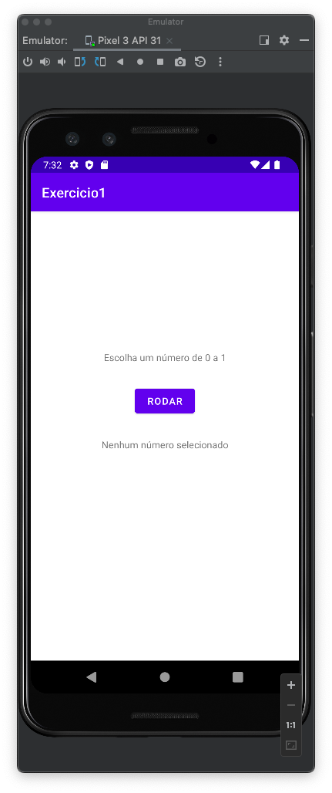
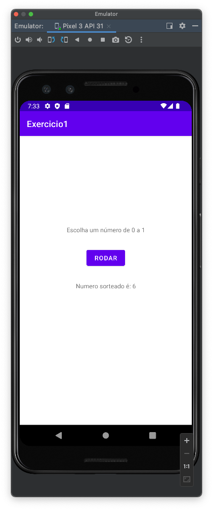

# Número Sorteado
VersionCode: 1.0

VersionName: "1"

# Introdução
Aplicativo didatico demostrando a utilização da linguagem de programação kotlin no desenvolvimento de aplicativos.

Nessa primeira versão será construído uma roleta automática, com o seguinte comportamento:

- Quando o usuário clicar no botão *Rodar*, será calculado um número aleatório, entre 0 e 10
- Esse número será apresentando para o usuário, *Número sorteado é:*

| Tela 1 | Tela 2     |
| ------------- | ------------- |
|||

# Authors

Danilo Santos
[@danilopsnts](https://www.linkedin.com/in/danilopsnts/)